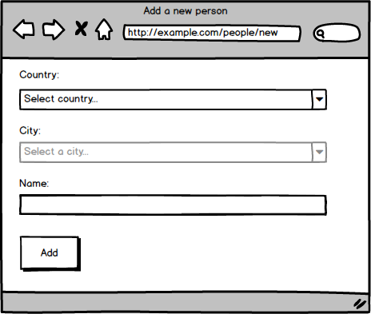

# Form Sample

Assume that you have a form like below to add a new person:

In this example, when you select a country from the populated select list, the city select element will be populated with options based on the selected country. This form page (`PersonCreationForm`) consists of below components:

 - CountrySelectionForm
 - CitySelectionForm
 
The question here is this: how should I communicate the selection from `CountrySelectionForm` component to `CitySelectionForm` component? Options:

 - Inside the `PersonCreationForm` component by just hooking up the `onCountrySelected` prop of `CountrySelectionForm` and passing the result to `CitySelectionForm` through is `country` prop. No need to go through Redux for this communication. However, changing the `country` prop triggers a change in `CitySelectionForm` to get cities based on selected country from Redux store.
 - On country selection, `PersonCreationForm` component dispatches the action indicating which country is selected. Based on that, `PersonCreationForm` gets notified and passes the result to `CitySelectionForm` through is `country` prop. That triggers a change in `CitySelectionForm` to get cities based on selected country from Redux store.
 - On country selection, `PersonCreationForm` component dispatches the action indicating which country is selected. Based on that, `CitySelectionForm` gets notified. That triggers a change in `CitySelectionForm` to get cities based on selected country from Redux store.
 
## Resources

 - [How to communicate UI state changes between React components with Redux?]()http://stackoverflow.com/questions/33570141/how-to-communicate-ui-state-changes-between-react-components-with-redux)
